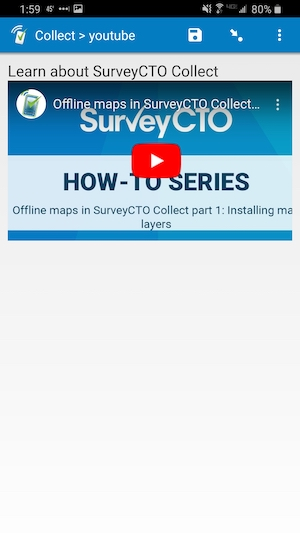
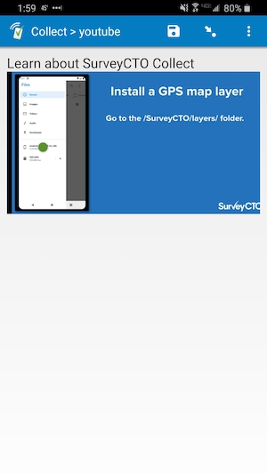

# scto-youtube

||
|:---:|
|Playing|

## Description

Use this field plug-in to easily embed YouTube videos into your form.

For this field plug-in, enter the link to the YouTube video for the `link` parameter (see **Parameters** below), and that YouTube video will be embedded into the field. It can be watched directly from there, with no need to open another application. Since the field does not take a value, make sure it is not *required*.

Note 1: The YouTube video will not be cached, so it can only be watched while the collection device is online.

Note 2: This plug-in does not work with [unlisted videos](https://support.google.com/youtube/answer/157177?co=GENIE.Platform%3DDesktop&hl=en).

## Default SurveyCTO feature support

| Feature / Property | Support |
| --- | --- |
| Supported field type(s) | `text`|
| Default values | Yes |
| Custom constraint message | No |
| Custom required message | No |
| Read only | No |
| media:image | Yes |
| media:audio | Yes |
| media:video | No |
| `number` appearance | No |
| `numbers_decimal` appearance | No |
| `numbers_phone` appearance | No |
| `show_formatted` appearance | No |

## How to use

**To use this field plug-in as-is**, just download the [youtube.fieldplugin.zip](youtube.fieldplugin.zip) file from this repo, and attach it to your form.

To create your own field plug-in using this as a template, follow these steps:

1. Fork this repo
1. Make changes to the files in the `source` directory.

    * **Note:** be sure to update the `manifest.json` file as well.

1. Zip the updated contents of the `source` directory.
1. Rename the .zip file to *yourpluginname*.fieldplugin.zip (replace *yourpluginname* with the name you want to use for your field plug-in).
1. You may then attach your new .fieldplugin.zip file to your form as normal.

## Parameters

There is one parameter, `link`, which is the link to the YouTube video. You can simply copy this from the URL bar of your web browser. For example, if you wanted to embed part 1 of the video series on [offline map layers](https://www.youtube.com/watch?v=hqJqh8teQaA), you would use this *appearance* for your text field:

    custom-youtube(link='https://www.youtube.com/watch?v=hqJqh8teQaA')

## More resources

* **Test form**  
[extras/testform](extras/testform)
* **Developer documentation**  
Instructions and resources for developing your own field plug-ins.  
[https://github.com/surveycto/Field-plug-in-resources](https://github.com/surveycto/Field-plug-in-resources)
* **User documentation**  
How to get started using field plug-ins in your SurveyCTO form.  
[https://docs.surveycto.com/02-designing-forms/03-advanced-topics/06.using-field-plug-ins.html](https://docs.surveycto.com/02-designing-forms/03-advanced-topics/06.using-field-plug-ins.html)
